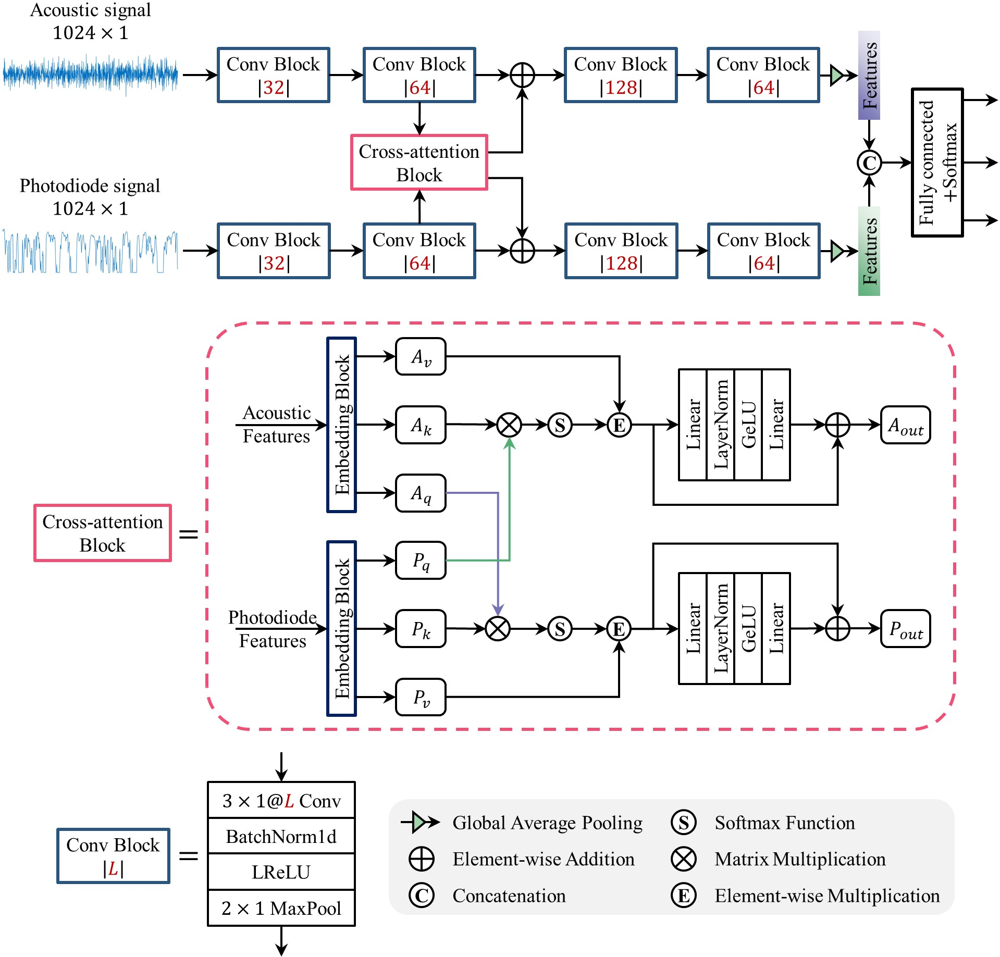

# CAFNet for Laser Welding Monitoring



<p align="left"> 
    <a href="https://www.python.org/">
        </a> 
    <a href="https://pytorch.org/">
        </a>
    <a href="LICENSE">
        </a>
    <a href="https://doi.org/10.1016/j.knosys.2022.110212">
        </a>
</p>

This repository contains source code for KBS paper "Cross-attention-based multi-sensing signals fusion for penetration state monitoring during laser welding of aluminum alloy". 

Codes are run on `Ubuntu 22.04` with `an Nvidia RTX 2080 GPU`. 

## Citation

If this project useful for your research, please cite the original journal paper with the following BibTex entry.

```
@article{cao_cross-attention-based_2023,
	title = {Cross-attention-based multi-sensing signals fusion for penetration state monitoring during laser welding of aluminum alloy},
	volume = {261},
	issn = {0950-7051},
	url = {https://www.sciencedirect.com/science/article/pii/S0950705122013089},
	doi = {https://doi.org/10.1016/j.knosys.2022.110212},
	journal = {Knowledge-Based Systems},
	author = {Cao, Longchao and Li, Jingchang and Zhang, Libin and Luo, Shuyang and Li, Menglei and Huang, Xufeng},
	year = {2023},
	pages = {110212},
}
```

